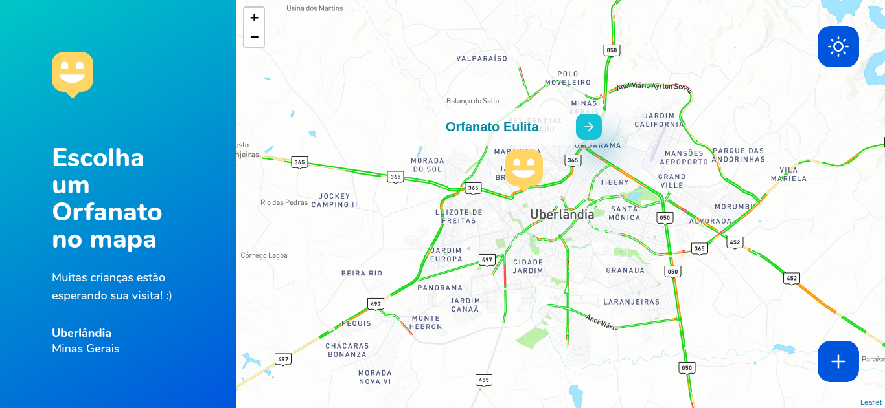
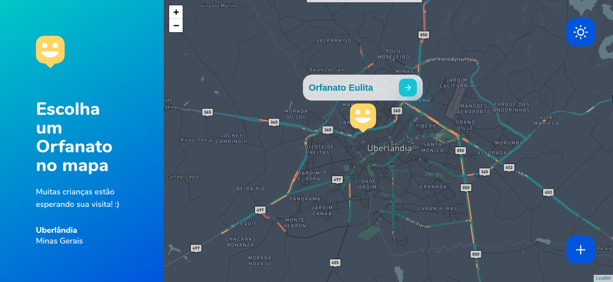
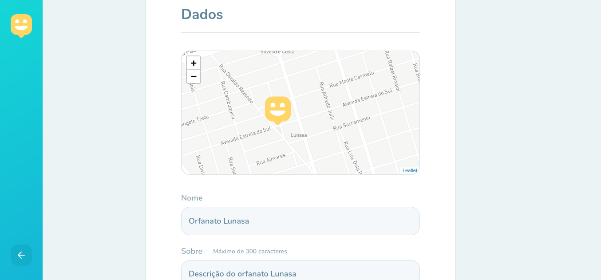
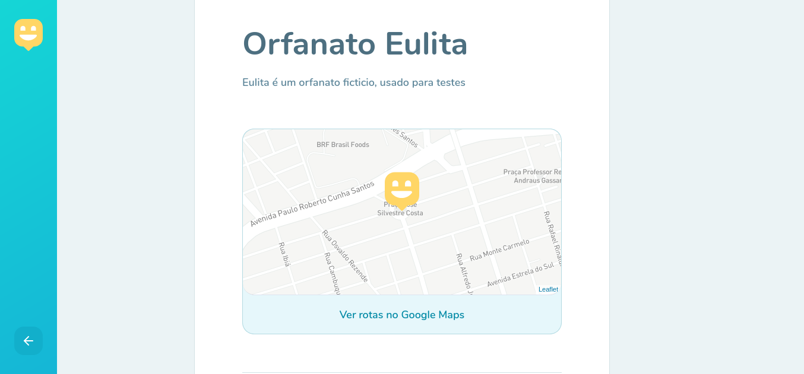

<h1 align="center" >
  
</h1>

<p align="center">Leve felicidade para o mundo, visite orfanatos e mude o dia de muitas crianças. NLW#3</p>

<h4 align="center"> 
	🚧  Em construção...  🚧
</h4>

<p align="center">
 <a href="#-sobre">Sobre</a> •
 <a href="#-layout">Layout</a> • 
 <a href="#-executando-o-happy">Como executar</a> • 
 <a href="#-tecnologias">Tecnologias</a> • 
 <a href="#-autor">Autor</a> 
</p>

---

## 💡 Sobre

Essa aplicação conecta orfanatos à possíveis visitantes! </br>Se você é de Uberlândia e está procurando um orfanato para visitar e alegrar o dia de muitas crianças este é o aplicativo que vai te indicar os orfanatos mais próximos.

Este projeto foi construído durante a terceira edição do evento Next Level Week da [Rocketseat](https://rocketseat.com.br/).

---

## 🎨 Layout


### Web

<p align="center">
  

  

  
  
  

  
</p>

---

## 💻 Executando o Happy

### Pré-requisitos

É necessário ter instalado na sua máquina para execução desse projeto:
- NodeJS
- Gerenciador de pacotes (Npm ou Yarn) 

> Em breve mais detalhes...

### ♊ Clonando o Repositório

```bash

$ git clone https://github.com/pereiraadiel/nlw3

# entre na pasta do projeto

$ cd nlw3

```
### 💻 Rodando o Happy web

Entre na pasta

```bash

$ cd web

```
Instale as dependências

```bash

$ yarn

# ou, caso use npm

$ npm install

```

Rode a aplicação

```bash

$ yarn start

# ou, caso use npm

$ npm start

```

Caso você tenha uma conta no [mapbox](https://www.mapbox.com/), pode usar seu token para utilizar o mapa da aplicação ( configurando uma variável ambiente de acordo com o arquivo .env.example ). No entanto, se você não quiser 
ter este trabalho, sem problemas, basta descomentar a linha 
```js
{/* <TileLayer url="https://a.tile.openstreetmap.org/{z}/{x}/{y}.png"/> */}
``` 
e comentar a linha
```js
<TileLayer url={`https://api.mapbox.com/styles/v1/mapbox/${mapTheme}/tiles/256/{z}/{x}/{y}@2x?access_token=${process.env.REACT_APP_MAPBOX_TOKEN}`} />
```
do arquivo OrphanagesMap.tsx em src/pages.
</br>
</br>
</br>
### 🌐 Rodando o Servidor

### ♊ Clonando o Repositório do servidor

```bash

$ git clone https://github.com/pereiraadiel/nlw3-backend

# entre na pasta do projeto

$ cd nlw3-backend

```
### 💻 Rodando o Happy web


Instale as dependências

```bash

$ yarn

# ou, caso use npm

$ npm install

```

Rode a aplicação

```bash

$ yarn dev

# ou, caso use npm

$ npm run dev

```


### 📱 Rodando a Aplicação Mobile 

> Em breve...

<br>

Se tudo deu certo, o app estará executando em [Localhost](http://localhost:3000) 👩‍🔧

---


## 🛠️ Tecnologias

As ferramentas usadas no desenvolvimento do projeto.

#### Backend:
- Typescript
- Node.Js 
- Express
- TypeORM

#### Web
- Typescript
- ReactJS ⚛️
- React Icons
- Leaflet 🍃
- API do Mapbox 🗺️

#### Mobile:

- Typescript
- React Native

---

## 📝 Autor

 <p>Feito com 💙 por Adiel Pereira</p>

